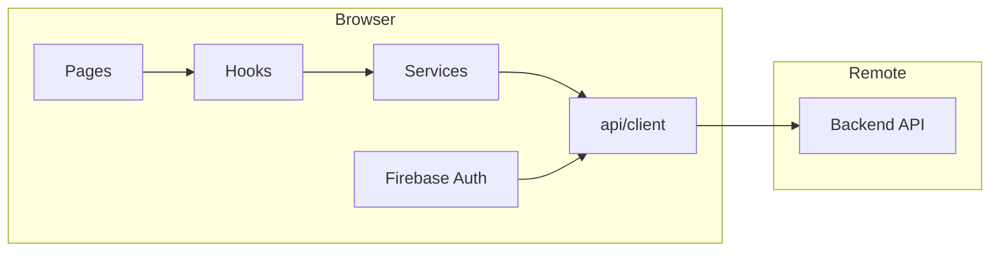

# Overview

## Stack

| Layer | Technology |
|-------|------------|
| UI | React **19**, function components |
| Build | **Vite** 7 with `@vitejs/plugin-react-swc` |
| Styling | **styled-components** 6; global CSS in `src/App.css`, `src/index.css` |
| Routing | **React Router** v7 (`react-router-dom`), `BrowserRouter` in `src/App.jsx` |
| Auth | **Firebase Auth** (`firebase/auth`) initialized in `src/firebase-config.js` |
| Charts | **Recharts** (dashboard) |
| Icons | **lucide-react**; SVG icons via `vite-plugin-svgr`, definitions in `src/assets/icons/icons.js` |
| Testing | **Vitest** + Testing Library + jsdom |

## Repository layout (high level)

- **`src/`** — Application source; `@/` alias points here (`vite.config.js`).  
- **`public/`** — Static assets served as-is (e.g. `logo.png`).  
- **`website/`** — This Docusaurus documentation site (separate `package.json`).  

## UI architecture conventions

From project guidelines:

- **Atomic design** — `common/components/atoms`, `molecules`, `organisms`.  
- **Pages** — Route-level screens under `src/pages/`.  
- **Hooks** — Reusable data logic under `src/hooks/` (`useDonors`, `useDonations`, etc.).  
- **Services** — HTTP wrappers for backend resources under `src/services/`.  

## Data flow (simplified)

Firebase issues ID tokens; the backend validates them and returns profile/role data merged in `UserContext`.

## Related

- [Routing and layout](./routing-and-layout)  
- [Authentication](./authentication)  
- [API client](./api-client)  
